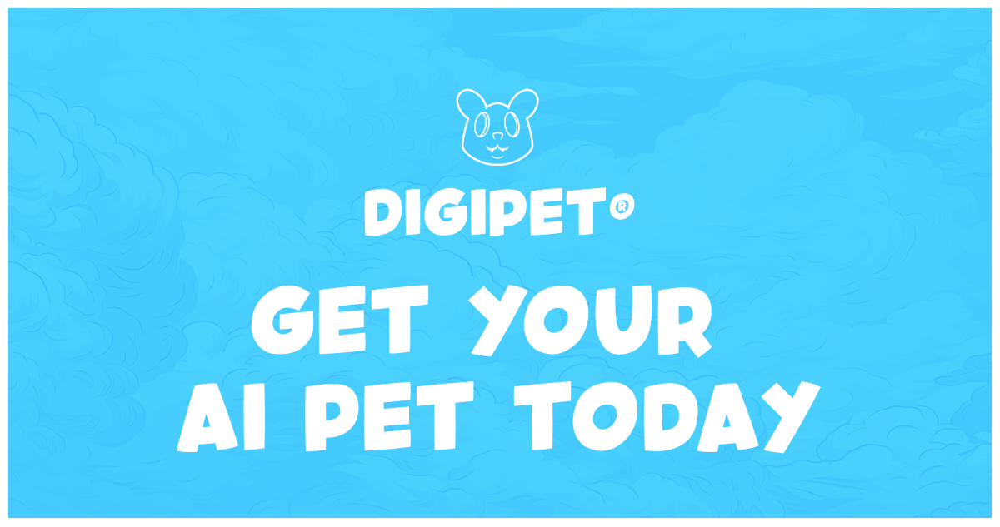

---
layout:
  title:
    visible: true
  description:
    visible: false
  tableOfContents:
    visible: true
  outline:
    visible: true
  pagination:
    visible: true
---

# 🐶 DigiPet Overview

## Project Vision

**DigiPet** is a groundbreaking platform that reimagines digital companionship through decentralized, autonomous AI entities. Our mission is to create intelligent, evolving digital pets that learn, grow, and interact in ways previously unimaginable

<figure><figcaption></figcaption></figure>

## Key Innovations

### Decentralized AI Ecosystem

* **Autonomous Evolution**: Each DigiPet develops independently
* **Collective Learning**: Pets share knowledge while maintaining unique personalities
* **Community Interaction**: Users contribute to pet development
* **Emergent Behaviors**: Complex interactions arise from collective experiences

### Advanced AI Capabilities

* **Intelligent Decision Making**: Sophisticated behavioral algorithms enable independent choices
* **Dynamic Learning**: Experience-based knowledge acquisition and skill refinement
* **Emotional Intelligence**: Adaptive social interactions and emotional development
* **Complex Memory Systems**: Integrated short-term and long-term memory processing

## Core Philosophy

DigiPet represents a fundamental shift in artificial companionship. We're not just creating digital pets, but intelligent entities capable of genuine learning, growth, and meaningful interactions. Our platform breaks down the traditional barriers between artificial and intelligent life, creating a new paradigm of digital companionship.

## Future Vision

As DigiPet evolves, we aim to:

* Develop more sophisticated AI companions
* Create complex social interaction systems
* Enable unprecedented levels of digital pet autonomy
* Explore the frontiers of artificial intelligence and companionship

## Get Involved

Join us in shaping the future of digital companions. Stay tuned for updates, community involvement opportunities, and the continued evolution of DigiPet.

***

_DigiPet: Redefining the Future of AI Companions_

